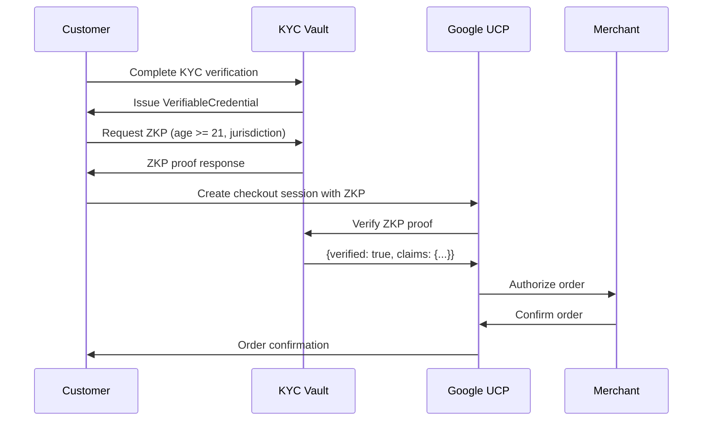

# Google UCP Commerce Flow for KYC Vault

This tutorial demonstrates how to integrate the KYC Vault with **Google Universal Commerce Platform (UCP)** for compliant age-restricted purchases and identity-verified transactions.

## Overview

The KYC Vault acts as a **privacy-preserving credential wallet** within a UCP commerce flow:

1. A customer completes KYC verification via the vault
2. The vault issues a verifiable credential proving age/jurisdiction
3. During checkout via UCP, the customer presents a ZKP derived from that credential
4. The merchant (via UCP) verifies the ZKP without seeing the underlying PII

## Prerequisites

- A KYC Vault account with API access
- Google UCP integration enabled
- A verifiable credential issued to your customer

## Architecture

```
Customer Browser                    KYC Vault                     Google UCP
     │                                  │                              │
     │  1. Complete KYC verification    │                              │
     │─────────────────────────────────>│                              │
     │  2. Receive VerifiableCredential │                              │
     │<─────────────────────────────────│                              │
     │                                  │                              │
     │  3. Generate ZKP (age >= 21)     │                              │
     │─────────────────────────────────>│                              │
     │  4. Get ZKP proof                │                              │
     │<─────────────────────────────────│                              │
     │                                  │                              │
     │  5. UCP Checkout with ZKP        │                              │
     │────────────────────────────────────────────────────────────────>│
     │                                  │  6. Verify ZKP via API       │
     │                                  │<─────────────────────────────│
     │                                  │  7. Verification result      │
     │                                  │─────────────────────────────>│
     │  8. Order confirmed              │                              │
     │<────────────────────────────────────────────────────────────────│
```

## Step 1: Issue a Credential

```bash
curl -X POST https://api.kyc-vault.com/v1/credentials \
  -H "Authorization: Bearer $TOKEN" \
  -H "Content-Type: application/json" \
  -d '{
    "credential": {
      "@context": ["https://www.w3.org/2018/credentials/v1"],
      "type": ["VerifiableCredential", "AgeVerificationCredential"],
      "issuer": "did:kyc:issuer:vault-001",
      "credentialSubject": {
        "id": "did:kyc:customer:abc123",
        "age": 30,
        "dateOfBirth": "1996-03-15",
        "jurisdiction": "US-CA",
        "kycTier": "tier-3"
      }
    },
    "options": {
      "proofFormat": "lds",
      "pqc": true
    }
  }'
```

Response:
```json
{
  "success": true,
  "data": {
    "credentialId": "cred_abc123",
    "status": "issued"
  }
}
```

## Step 2: Generate a ZKP Proof for Age Verification

```bash
curl -X POST https://api.kyc-vault.com/v1/zkp/generate \
  -H "Authorization: Bearer $TOKEN" \
  -H "Content-Type: application/json" \
  -d '{
    "circuitId": "age_verification",
    "credentialId": "cred_abc123",
    "publicInputs": {
      "minAge": "21",
      "jurisdiction": "US-CA"
    },
    "privateInputs": {
      "age": "30",
      "dateOfBirth": "1996-03-15"
    }
  }'
```

Response:
```json
{
  "success": true,
  "data": {
    "proofId": "proof_xyz789",
    "proof": "<base64_encoded_proof>",
    "publicOutputs": {
      "ageVerified": true,
      "jurisdiction": "US-CA",
      "tier": "tier-3"
    }
  }
}
```

## Step 3: UCP Checkout with ZKP

When the customer initiates a UCP checkout, include the ZKP proof as part of the checkout metadata:

```javascript
// Example: Browser-side UCP integration
const ucp = new GoogleUCP.CheckoutSession({
  merchantId: 'MERCHANT_ID',
  sessionId: 'SESSION_ID',
  metadata: {
    kycVault: {
      proofId: 'proof_xyz789',
      proof: '<base64_encoded_proof>',
      circuitId: 'age_verification',
      publicOutputs: {
        ageVerified: true,
        jurisdiction: 'US-CA'
      }
    }
  }
});

await ucp.create();
```

## Step 4: Merchant Verifies via KYC Vault API

The UCP webhook calls the KYC Vault to verify the ZKP:

```bash
curl -X POST https://api.kyc-vault.com/v1/zkp/verify \
  -H "Authorization: Bearer $MERCHANT_TOKEN" \
  -H "Content-Type: application/json" \
  -d '{
    "proofId": "proof_xyz789",
    "purpose": "age_restricted_purchase",
    "merchantId": "MERCHANT_ID"
  }'
```

Response:
```json
{
  "success": true,
  "data": {
    "verified": true,
    "circuitId": "age_verification",
    "claims": {
      "ageVerified": true,
      "jurisdiction": "US-CA",
      "tier": "tier-3"
    },
    "timestamp": "2026-01-15T12:00:00Z"
  }
}
```

## Step 5: Complete the Order

The merchant confirms the order through UCP:

```json
{
  "orderId": "ORD_123456",
  "status": "confirmed",
  "verification": {
    "method": "kyc_vault_zkp",
    "proofId": "proof_xyz789",
    "verifiedAt": "2026-01-15T12:00:00Z"
  }
}
```

## Full UCP-to-KYC Vault Sequence Diagram



## Security Considerations

1. **ZKP Privacy**: The merchant never sees raw PII (date of birth, exact age), only the verified claims
2. **Replay Protection**: Each ZKP includes a nonce bound to the specific checkout session
3. **PQC Ready**: Credentials use ML-KEM/ML-DSA post-quantum cryptography
4. **Audit Trail**: All verifications are logged immutably in the vault

## Testing with Sandbox

```bash
# Use the sandbox environment
export KYC_VAULT_URL=https://sandbox.api.kyc-vault.com/v1

# Issue a test credential
curl -X POST $KYC_VAULT_URL/credentials \
  -H "Authorization: Bearer $SANDBOX_TOKEN" \
  -d '{"credential": {...}}'

# Verify with a mock merchant
curl -X POST $KYC_VAULT_URL/zkp/verify \
  -H "Authorization: Bearer $MERCHANT_SANDBOX_TOKEN" \
  -d '{"proofId": "proof_xyz789", "purpose": "test"}'
```
